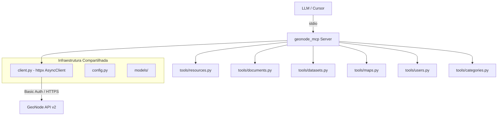

# MCP Server para GeoNode API v2

## Contexto

A API REST v2 do GeoNode em `https://my-geonode.org/api/v2/` expoe 17 endpoints:

| Endpoint | Total registros | Metodos HTTP |
|----------|----------------|--------------|
| resources | 9.798 | GET |
| datasets | 6.854 | GET, POST, PUT, PATCH, DELETE |
| documents | 2.711+ | GET, POST, PUT, PATCH, DELETE |
| maps | 209 | GET, POST, PUT, PATCH, DELETE |
| users | 396 | GET, PUT, PATCH |
| groups | 45 | GET |
| categories | 21 | GET |
| regions | 259 | GET |
| keywords | 1.511 | GET |
| owners | 139 | GET |
| geoapps | 19 | GET, POST, PUT, PATCH, DELETE |
| uploads | - | GET, POST |
| assets | - | GET |

Autenticacao: HTTP Basic Auth. API suporta filtros via `filter{campo}=valor` e paginacao via `page` e `page_size`.

## Arquitetura

```
mcp-geonode-api/
  docs/
    original-plan.md
  src/
    geonode_mcp/
      __init__.py
      server.py          # Ponto de entrada FastMCP
      config.py           # Configuracao (URL base, credenciais via env vars)
      client.py           # Cliente HTTP async compartilhado (httpx)
      models/
        __init__.py
        common.py         # Modelos Pydantic compartilhados
        resources.py
        documents.py
        datasets.py
        maps.py
        users.py
      tools/
        __init__.py
        resources.py
        documents.py
        datasets.py
        maps.py
        users.py
        categories.py
```



## Tools implementadas (26 tools)

### Leitura - Resources (generico)
- `geonode_search_resources` - Busca textual em todos os resources com filtros
- `geonode_get_resource` - Details de um recurso por ID

### CRUD - Documents
- `geonode_list_documents` - Listar documentos com filtros
- `geonode_get_document` - Details de um documento por ID
- `geonode_create_document` - Criar documento (upload ou link)
- `geonode_update_document` - Atualizar metadados
- `geonode_delete_document` - Excluir documento

### CRUD - Datesets
- `geonode_list_datasets` - Listar datasets com filtros
- `geonode_get_dataset` - Details de um dataset por ID
- `geonode_create_dataset` - Upload de dataset
- `geonode_update_dataset` - Atualizar metadados
- `geonode_delete_dataset` - Excluir dataset

### CRUD - Maps
- `geonode_list_maps` - Listar mapas com filtros
- `geonode_get_map` - Details de um mapa por ID
- `geonode_create_map` - Criar mapa
- `geonode_update_map` - Atualizar mapa
- `geonode_delete_map` - Excluir mapa

### Users e Groups
- `geonode_list_users` - Listar/buscar usuarios
- `geonode_get_user` - Details de um usuario
- `geonode_update_user` - Atualizar dados de usuario
- `geonode_list_groups` - Listar grupos
- `geonode_get_group` - Details de um grupo

### Catalogo (somente leitura)
- `geonode_list_categories` - Listar categorias
- `geonode_list_keywords` - Listar/buscar keywords
- `geonode_list_regions` - Listar regioes
- `geonode_list_owners` - Listar owners

## Decisoes tecnicas

- **Transporte**: stdio (uso local no Cursor/Cline/OpenCode)
- **Autenticacao**: Credenciais via variaveis de ambiente `GEONODE_URL`, `GEONODE_USER`, `GEONODE_PASSWORD`
- **SSL**: Desabilitar verificacao SSL (certificado do servidor tem problema com cadeia local)
- **Paginacao**: Todas as tools de listagem recebem `limit` (default 20, max 100) e `offset`
- **Formato de resposta**: Suporte a Markdown (default) e JSON
- **Cliente HTTP**: httpx com `AsyncClient` reutilizado via lifespan
- **Dependencias**: `mcp[cli]`, `httpx`, `pydantic`
